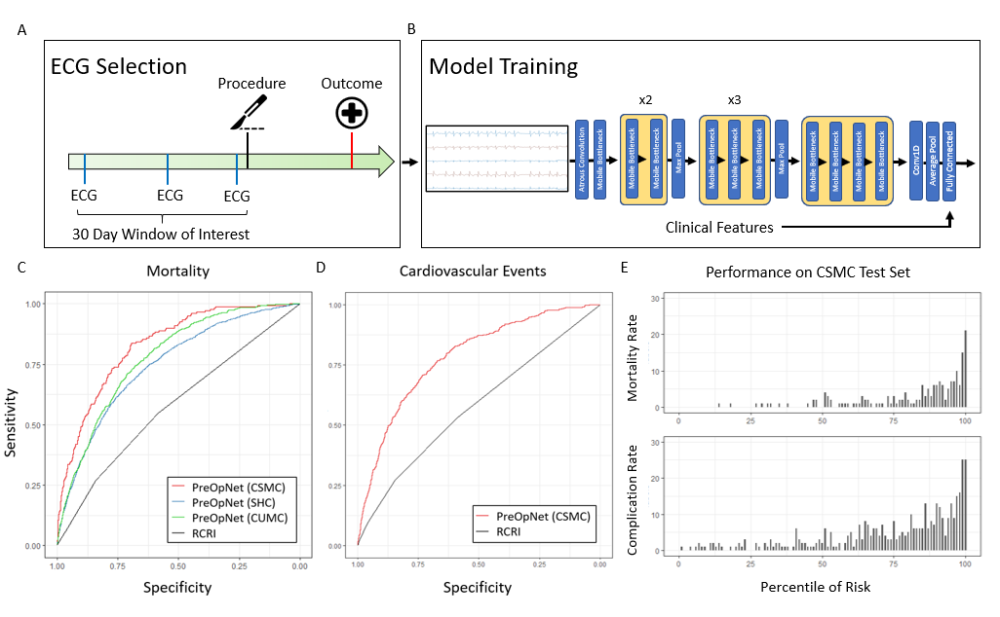

# PreOpNet

PreOpNet is the first purpose built deep learning architecture for predicting perioperative outcomes, and its predictive performance was superior to previously published neural architectures for interpreting ECGs despite requiring less computational processing.

## Preprocessing

The first notebook, Process Data.ipynb will convert your xml files to normalized numpy arrays. To run the notebook, edit the args dictionary with your relivent information

1. in_XML: Where your XML files are located, put None if there is an existing set of numpy arrays
2. in_csv: Where your csv is located. This csv should have a column labeled 'Filename', with the names of the numpy files, and a column for every topic of interest (mortality and MACE)
3. in_dataset: Where your numpy arrays are located, or will be located.
4. out_dataset: Where your normalized EKGs will be located
5. sample: The size of the random sample you will use to estimate mean and std

## Inference:

This notebook will calculate the AUC, confusion matrix, and predictions for your dataset

To run this notebook, fill out these variables:
1. Val_root: The location of your input dataset (this should match out_dataset from the first notebook)
2. Val_csv: The csv of your input dataset (this should match in_csv from the first notebook)
3. target: If you are testing on a column in your input dataset labeled something other than 'Mortality', you must provide a target to val_dataloader
4. checkpoint: Provide the path to the model checkpoint (PreOpNet Mortality best_roc_model.pt, PreOpNet MACE best_roc_model.pt)
